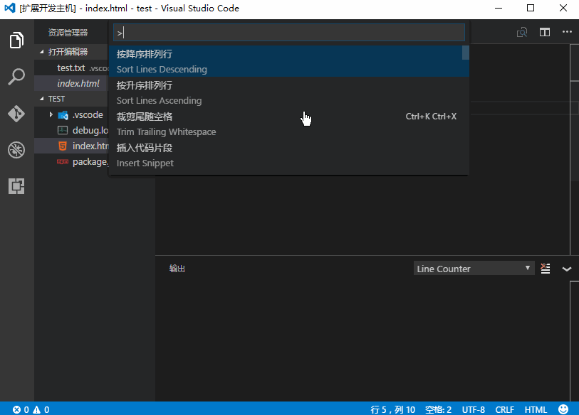

# line-counter README

## Features

This is the first version of line-counter plugin. It countributes 2 commands to count the LOC of current opened file and the whole workspace:

- Count current file
- Count workspace

